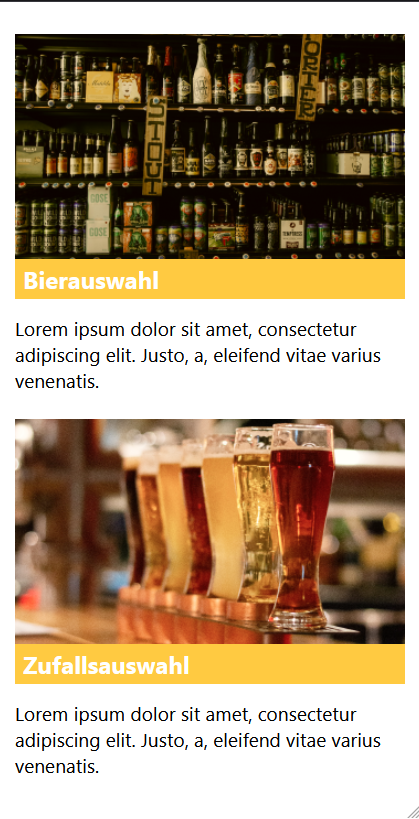
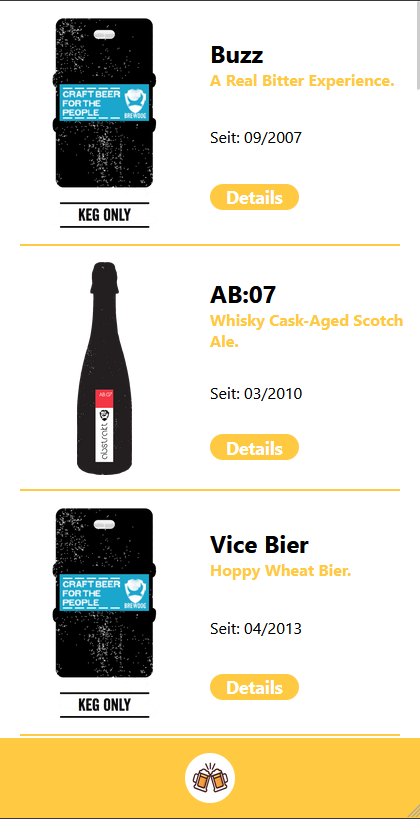
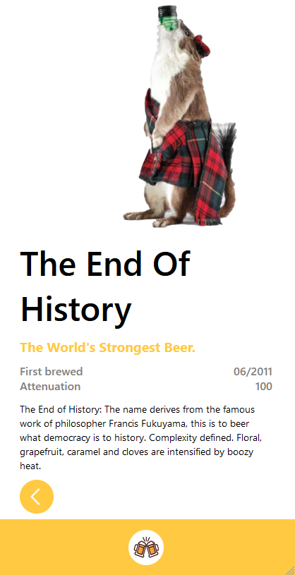
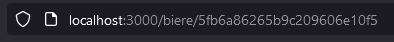
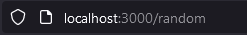
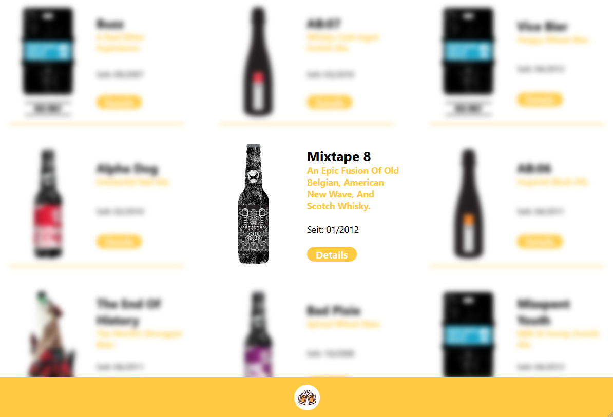

# Aufgabenstellung

Heute erstellen wir eine Homepage zum Thema Bier mit Hilfe einer API

Nutze diese API!

Hinweis

Nutze console.log, um dir den Aufbau der API anzuzeigen.
Figma Link: https://www.figma.com/file/3vXkjBNmgJVpSz2HaCprE6/Beer-Api?node-id=0%3A1

Erstelle die Grundstruktur deiner Homepage:

Alle Biere
Zufälliges Bier

Erstelle eine Navbar, die immer angezeigt wird, wenn du nicht auf der Startseite bist. Diese führt zurück zur Startseite.

Liste die Biere auf. Es sollte enthalten sein:
Bild
Name 
Slogan (tagline)
Produzent (contributed_by)
Erstelle zusätzlich einen Link, der zu der Detailseite des Bieres führt!
Der Link sollte z.B. zu /beers/:beerId führen
Hinweis
Du kannst die API auch mit
beers/bierID anrufen! z.B.: https://ih-beers-api2.herokuapp.com/beers/5fb6a86265b9c209606e10e0

Erstelle die Bier-Detailansicht, hier sollte
das Bild
der Name
der Slogan (tagline)
wann es das erste Mal gebraut wurde (first_brewed)
das attenuation_level
die Beschreibung
der Produzent (contributed_by)
angezeigt werden. 

Erstelle die “zufälliges Bier”-Seite
Nutze hier den random-Endpunkt der API 
Der Aufbau der Seite ist wie die Detailansicht

## Mein Ergebnis

